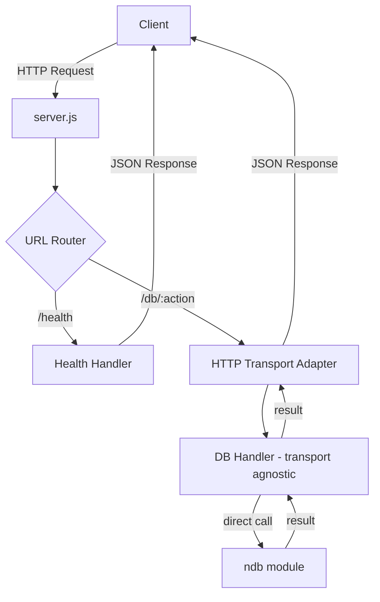

# Phase 1: Foundation — Implementation Plan

> Vanilla HTTP server with nDB proxy routes

**Reference:** [nGDB Spec](../docs/nGDB-spec.md) · [nGDB Dev Plan](../docs/nGDB-development-plan.md)

---

## Deliverable

`curl http://localhost:3000/health` returns OK with nDB connected.

---

## Project Structure

```
nGDB/                              <- Workspace root
├── src/
│   ├── server.js                  <- HTTP server entry point
│   ├── config.js                  <- Environment config
│   ├── handlers/
│   │   └── db.js                  <- Transport-agnostic nDB proxy handlers
│   └── transports/
│       └── http.js                <- HTTP request/response adapter
├── tests/
│   └── phase1_test.js             <- Integration tests against live server
├── package.json                   <- nGDB package with ndb/nvdb as deps
├── docs/                          <- Existing documentation
├── ndb/                           <- git submodule
└── nvdb/                          <- git submodule
```

---

## Architecture



---

## Files to Create

### 1. `package.json`

- Name: `ngdb`
- Version: `0.1.0`
- Main: `src/server.js`
- Dependencies: `ndb` via `file:./ndb/napi`, `nvdb` via `file:./nvdb/napi`
- Scripts: `start`, `test`
- No external npm packages — vanilla Node.js only

### 2. `src/config.js`

Environment-driven configuration:
- `PORT` — default `3000`
- `HOST` — default `0.0.0.0`
- `NDB_DATA_DIR` — default `./data/ndb`
- `NVDB_DATA_DIR` — default `./data/nvdb`

Reads from `process.env` directly. No config files, no YAML parsing.

### 3. `src/handlers/db.js`

Transport-agnostic handlers that call nDB native API directly:

| Handler | nDB API Call | Params |
|---------|-------------|--------|
| `open` | `Database.open(path, options)` | `{ path, options }` |
| `close` | instance cleanup | `{ id }` |
| `insert` | `db.insert(doc)` | `{ doc }` |
| `get` | `db.get(id)` | `{ id }` |

Each handler is a plain async function: `params -> result`.
No HTTP knowledge — pure business logic proxying to nDB.

**Database instance management:** A simple `Map<string, Database>` to track open instances by a generated handle ID.

### 4. `src/transports/http.js`

HTTP adapter that:
- Parses incoming request body as JSON
- Routes `/db/:action` to the matching handler in `handlers/db.js`
- Returns JSON responses with appropriate status codes
- Handles errors with proper HTTP status mapping

### 5. `src/server.js`

Entry point that:
- Creates a vanilla `http.createServer`
- Sets up URL routing: `/health`, `/db/*`
- Starts listening on configured port/host
- Logs startup message

### 6. `tests/phase1_test.js`

Integration tests that:
- Start the server programmatically
- Test `/health` returns healthy status
- Test `/db/open` opens a database
- Test `/db/insert` inserts a document
- Test `/db/get` retrieves a document
- Clean up after tests

Uses Node.js built-in `http` module for requests — no test frameworks.

---

## Handler Mapping Detail

### nDB Routes for Phase 1

```
POST /db/open     -> handlers.db.open({ path, options })    -> { handle }
POST /db/close    -> handlers.db.close({ handle })          -> { ok }
POST /db/insert   -> handlers.db.insert({ handle, doc })    -> { id }
POST /db/get      -> handlers.db.get({ handle, id })        -> { doc }
```

### Health Route

```
GET /health       -> { status: 'healthy', backends: { ndb: 'available' } }
```

---

## Key Design Decisions

1. **Handle-based DB access:** Since HTTP is stateless but nDB Database instances are stateful, we use a handle pattern. `open` returns a handle ID, subsequent operations reference that handle.

2. **No framework:** Raw `http.createServer` with manual URL parsing via `URL` and `URLSearchParams` APIs.

3. **No external deps:** Zero npm packages. Only `ndb` and `nvdb` as local file dependencies.

4. **Fail fast:** No try/catch wrapping in handlers. Errors propagate naturally. The HTTP transport adapter catches at the top level to return 500.

5. **JSON in/out:** All requests and responses are JSON. Body parsed with `JSON.parse`, responses via `JSON.stringify`.

---

## Execution Order

1. Create `package.json` with dependencies
2. Create `src/config.js`
3. Create `src/handlers/db.js` with open/close/insert/get handlers
4. Create `src/transports/http.js` with request routing
5. Create `src/server.js` entry point
6. Create `tests/phase1_test.js` integration tests
7. Run `npm install` to link ndb submodule
8. Run `npm test` to verify
